# InstaHub
InstaHub is a simple Instagram clone application built with Python, Django, Bootstrap and PostgreSQL.

## Technologies Used
- Python
- Django
- PostgreSQL
- Bootstrap

## Features
- User registration and authentication
- Profile management (edit profile, change password)
- Follow/unfollow users
- Create, edit and delete posts with images
- Like/unlike posts
- View user profiles and posts
- User search functionality

## Screenshots

### Registration
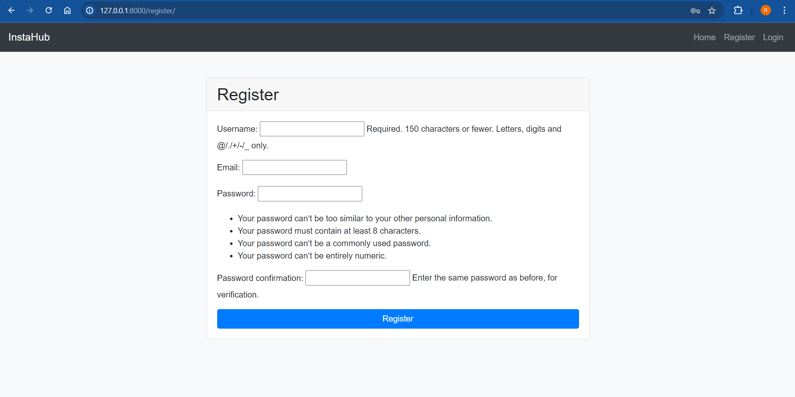
*User registration form with fields for username, email and password.*

### Login
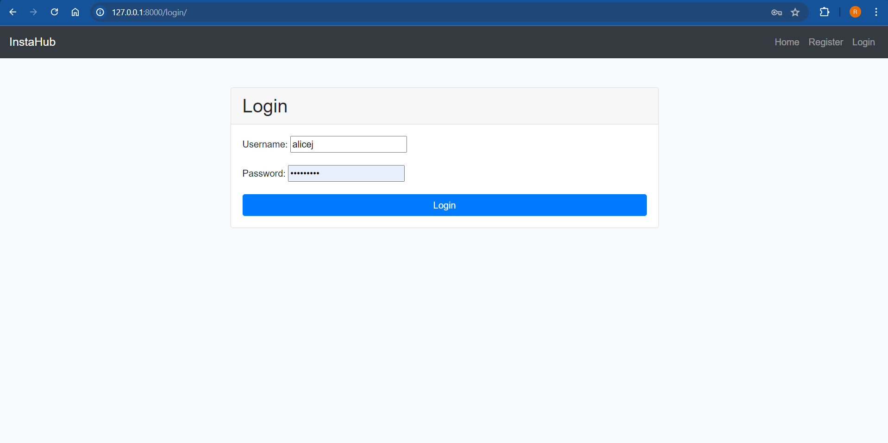
*User login form with fields for username and password.*

### Homepage
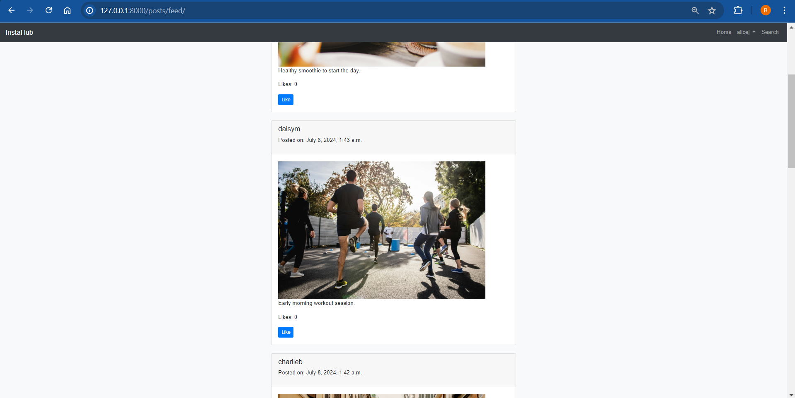
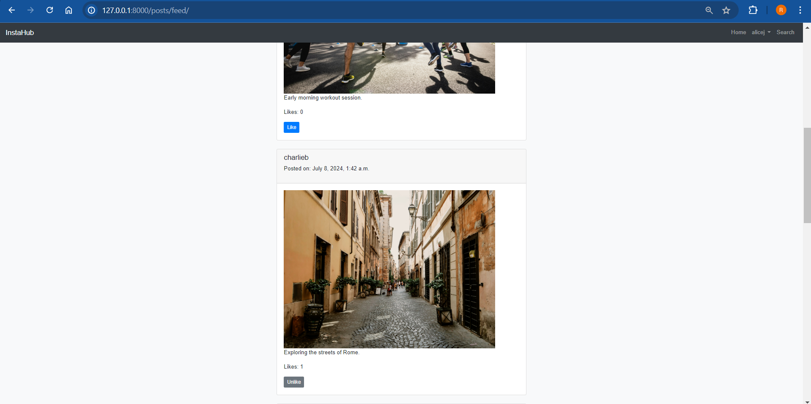
*The homepage displaying the posts from different followers.*

### Likes
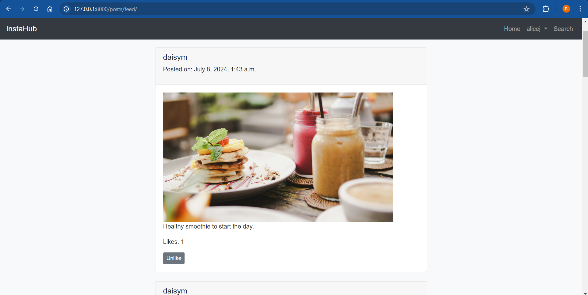
*Like/unlike functionality on posts.*

### Profile Page
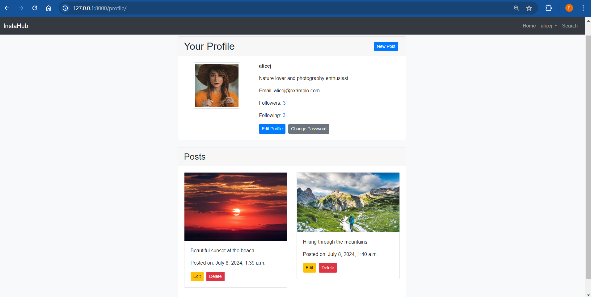
*User profile page with profile picture, bio, email, followers, following and user's posts.*

### Followers
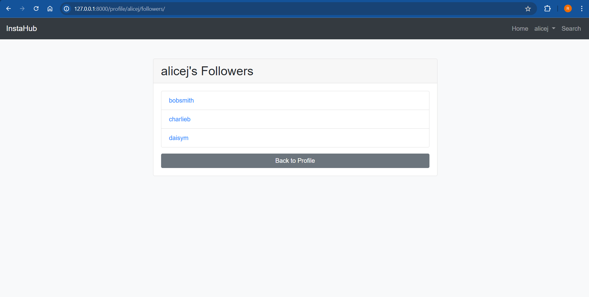
*User's followers list.*

### Following
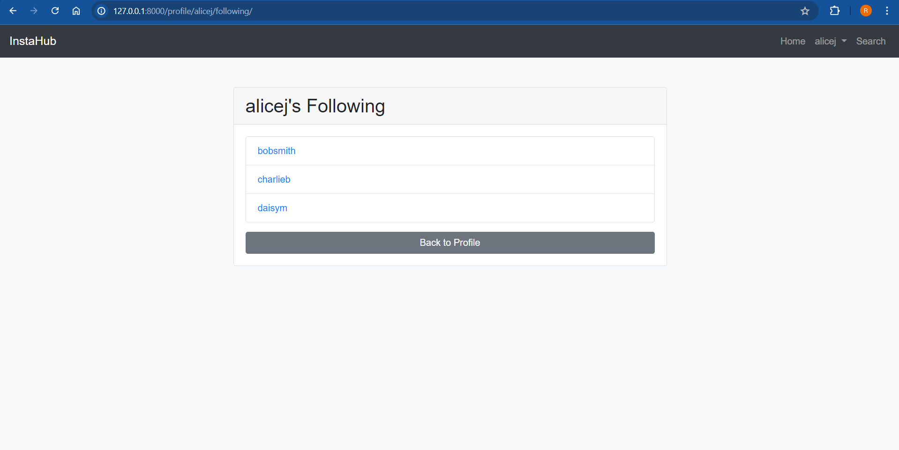
*User's following list.*

### New Post
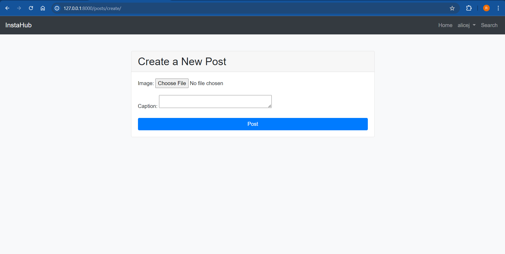
*Form for creating new posts.*

### Edit Post
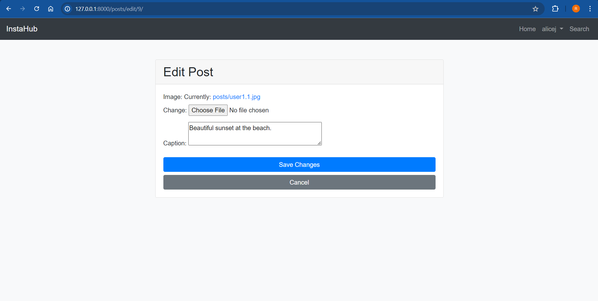
*Form for editing a post.*

### Edit Profile
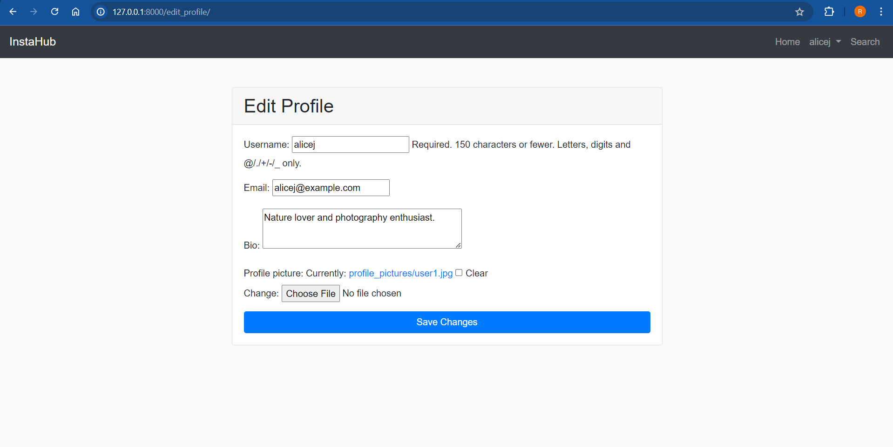
*Form for editing user profile information.*

### Change Password
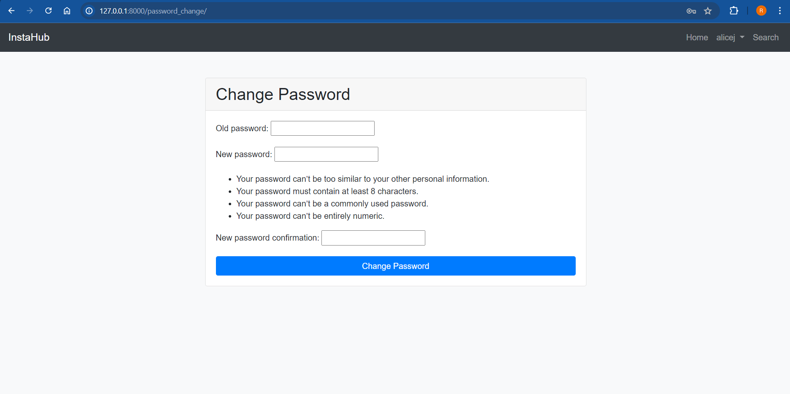
*Form for changing user password.*

### Search Users
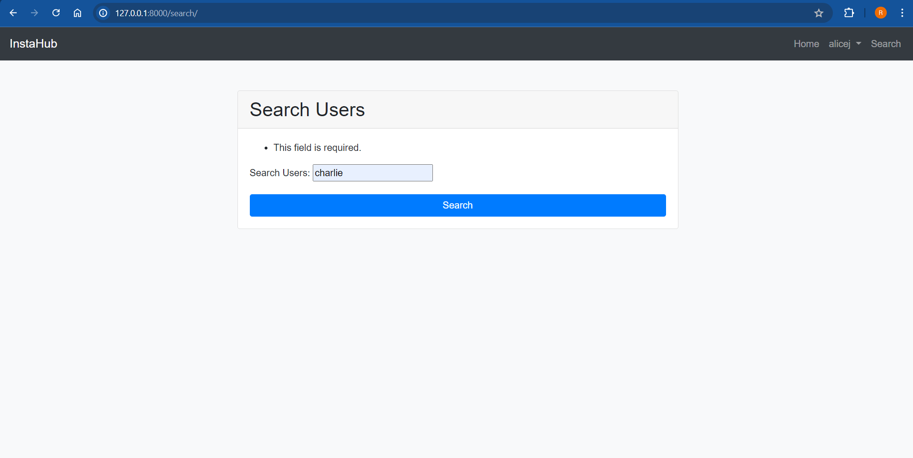
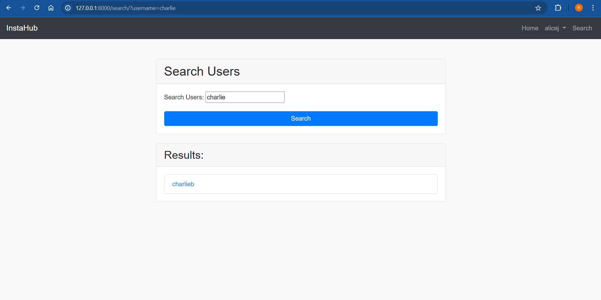
*Search form and results for finding other users*

### Follow/Unfollow
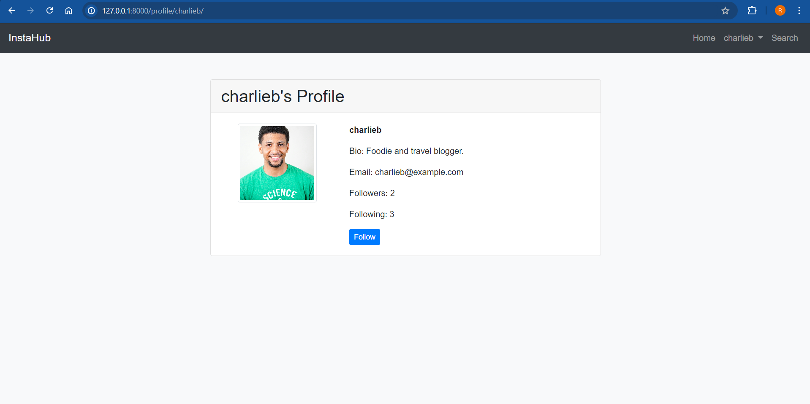
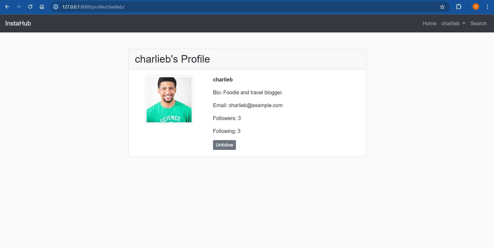
*Follow/Unfollow functionality on a user profile.*

### Logout
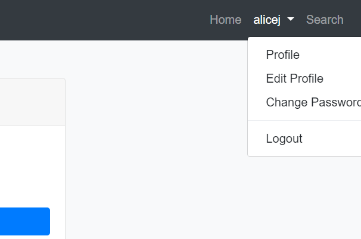
*Logout option in the dropdown along with Profile, Edit Profile and Change Password.*

### Admin Interface
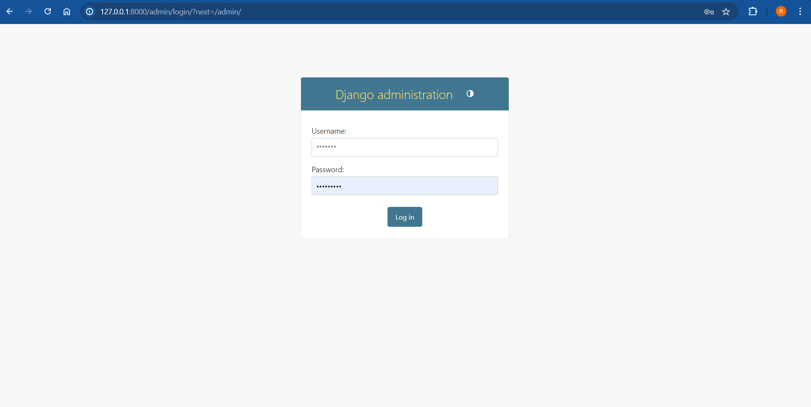
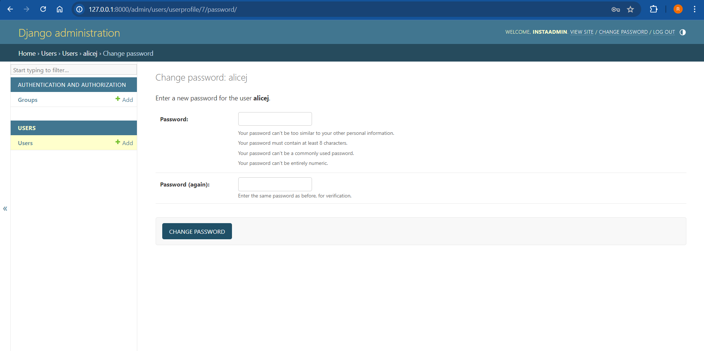
*Admin interface login and form form changing the password of a user.*